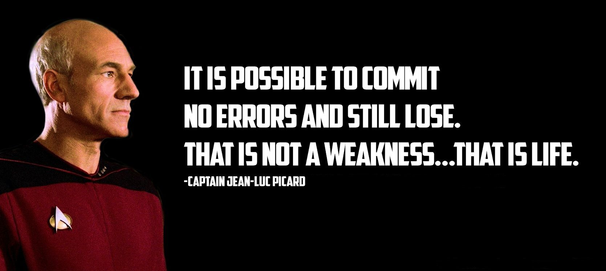

# Brian's User Page!  
  
## **Table of Contents**  
[As a programmer](#as-a-programmer)  
[Programming Languages](#programming-languages-in-order-of-familiarity)  
[About me](#about-me)  
[Quotes](#a-quote-that-i-like)  
[Goals](#goals-for-spring-2021)  
[Helpful Resources](#helpful-resources)
[Happy Cat](#thanks-for-reading)
  
## **As a programmer**  
When programming, my general approach is to do some basic brainstorming and then try to implement it. Whether that attempt succeeds or fails, I try to improve it with the next iteration. I will note that this may not be the best approach, because sometimes my initial attempt fails so spectacularly that I need to start from scratch. Another possibility is that I create something and realize that the improvements I want to make require quite a bit of refactoring. Despite this, I think there is some benefit to this approach in that my following iterations are made with more considerations than what may have been possible without trying an implementation. In terms of debugging, I use `console.log()`, `printf()`, `cout`, `print()`, or `System.out.print()`. The general idea here is I don't use a debugger too often. I know that I should get more comfortable with using a debugger, but outside of C++, C, or Java, I never use it. Being comfortable using a debugger has always been on my todo list and this quarter I plan on working on it.
  
### Programming Languages in Order of Familiarity  
1. HTML, CSS, Javascript
2. C++
3. Python
4. Java
5. C

## **About me**  
I am a third year cognitive science major in Revelle College. I am currently trying to finish up my minor in computer science. Outside of academics, I enjoy playing videogames, learning the piano and cooking. When I have the opportunity to play some games, I have been sinking some hours into Valorant and Valheim. Nowadays, I find myself using games as a medium to hang out with friends or family. Recently, I have been trying to learn to play the piano. So far, progress has been a little slow, but I am trying.
  
### Two Quotes that I Like  
The first one is from Star Trek. I haven't watched too much of it, but I do like this quote.  

  
I think this quote from Eleanor Roosevelt goes well with the previous quote:  
> If life were predictable it would cease to be life, and be without flavor.
  
### Goals for Spring 2021
- [ ] Pass all my classes
- [ ] Improve my ability to work in groups
- [ ] Stay on top of my school work
- [ ] Keep up with friends and family
- [ ] Get more comfortable with debuggers
- [X] Finish this lab

## Helpful Resources
- [Stack Overflow](https://stackoverflow.com/)
- [MDN](https://developer.mozilla.org/en-US/)
- [GeeksforGeeks](https://www.geeksforgeeks.org/)
  
## Thanks for Reading!  
Here's a happy cat.  

